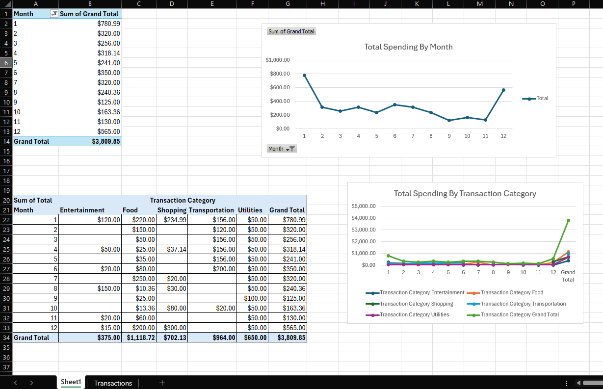
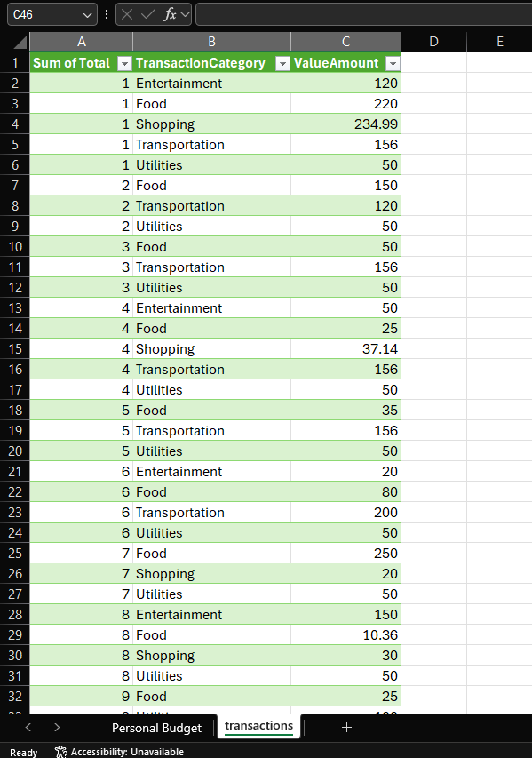
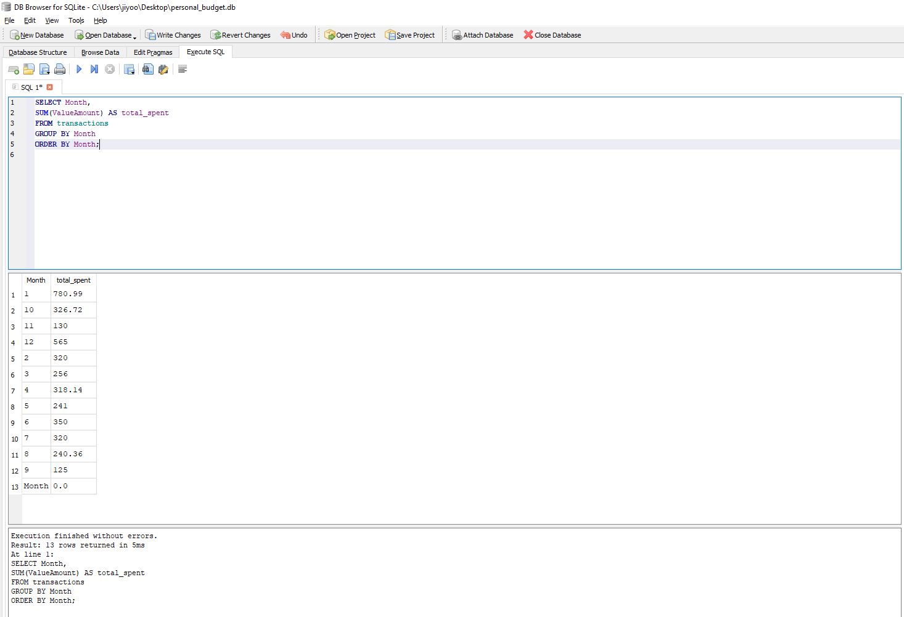
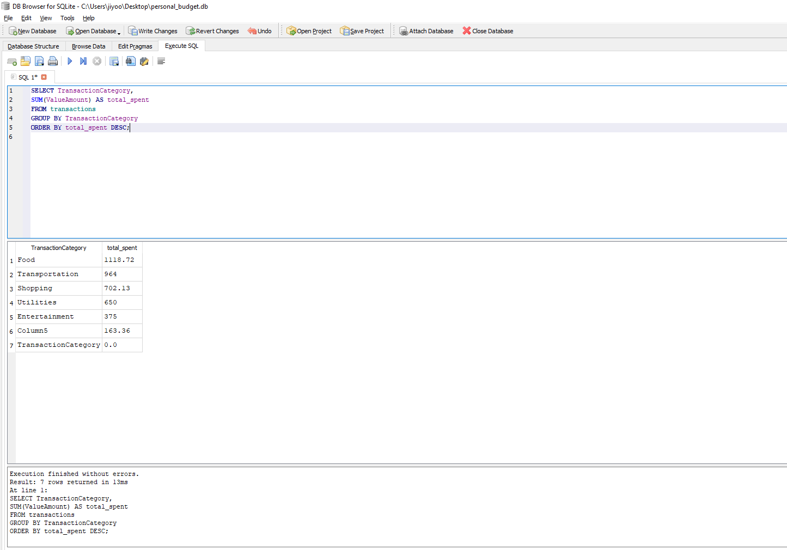
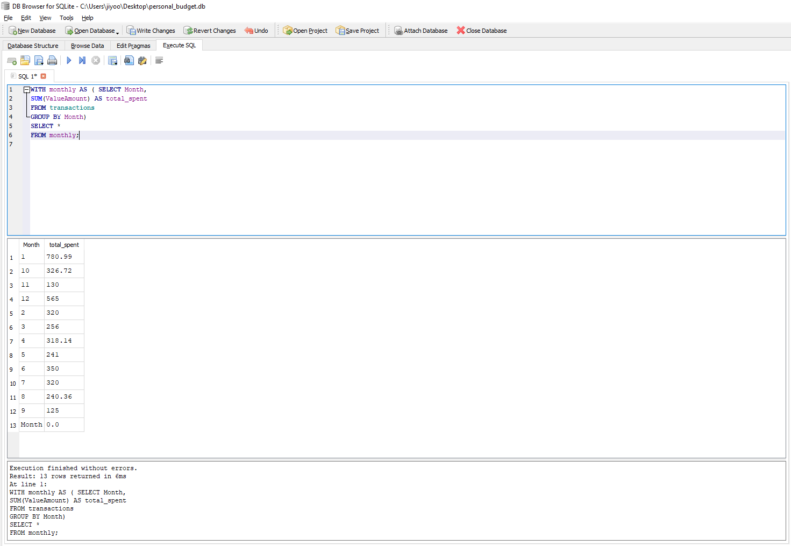
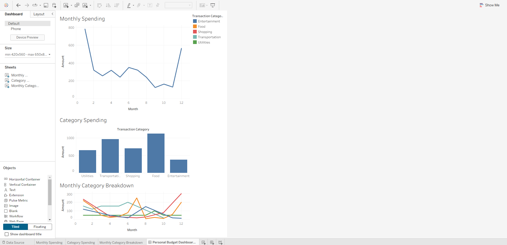

# Personal-Budget-Analysis (Excel → SQLite → Tableau)
Hello, this project is an end-to-end analysis of 12 months of personal spending. I cleaned the raw data in Excel, reshaped it using Power Query, imported it into SQLite for SQL analysis, and then built visual dashboards in Tableau.
The goal was to demonstrate a realistic data workflow used in entry-level data analyst roles.

Tools Used:
- Excel – data cleaning, formatting, and Power Query (unpivoting)
- SQLite + DB Browser – database creation, CSV import, SQL queries
- SQL – grouping, aggregations, CTEs
- Tableau Public – dashboards and visual analytics
- GitHub – documentation and version control

Project Overview
1. Data Preparation (Excel)
- Cleaned and organized raw monthly expense data
- Removed pivot output columns such as “Grand Total”
- Used Power Query to unpivot the dataset into a tidy long format: Month | TransactionCategory | Amount
- Saved the cleaned dataset as transactions.csv for use in SQL and Tableau

2. SQL Analysis (SQLite)
The cleaned CSV was imported into a SQLite database (personal_budget.db).
I used SQL to calculate monthly totals, category totals, and produce summary tables.

- Total Spending per Month:
SELECT Month, SUM(ValueAmount) AS total_spent
FROM transactions
GROUP BY Month
ORDER BY Month;

- Total Spending per Category:
SELECT TransactionCategory, SUM(ValueAmount) AS total_spent
FROM transactions
GROUP BY TransactionCategory
ORDER BY total_spent DESC;

- Monthly Summary Using a CTE:
WITH monthly AS (
SELECT Month, SUM(ValueAmount) AS total_spent
FROM transactions
GROUP BY Month
)
SELECT *
FROM monthly;

All queries used are stored in sql_queries.txt.

3. Tableau Dashboard
I imported the cleaned CSV into Tableau Public and created three main visualizations:
- Monthly Spending Trend (line chart)
- Spending by Category (bar chart)
- Monthly Category Breakdown (stacked bar chart)
These were combined into a single dashboard to display spending habits visually.

Dashboard Link: https://public.tableau.com/views/PersonalBudgetAnalysisDashboard/PersonalBudgetDashboardExcelSQLTableau?:language=en-US&publish=yes&:sid=&:redirect=auth&:display_count=n&:origin=viz_share_link

Files Included:
BudgetProject.xlsx – Excel workbook containing cleaned data
transactions.csv – Final dataset used for SQL and Tableau
personal_budget.db – SQLite database containing the transactions
sql_queries.txt – All SQL queries used
tableau_dashboard.twbx – Tableau workbook (optional if exported)
/ images – Screenshots of Excel, SQL results, and Tableau dashboard
README.md – This documentation file

Key Skills Demonstrated:
- Data cleaning and transformation
- Power Query unpivoting and ETL basics
- SQL aggregations, grouping, and CTEs
- Tableau dashboard creation
- End-to-end analytics workflow

Summary:
- This project demonstrates my capability to complete data workflow: cleaning raw Excel data, transforming it into analyzable form, loading it into a database, writing SQL queries for insights, and visualizing results in Tableau.
